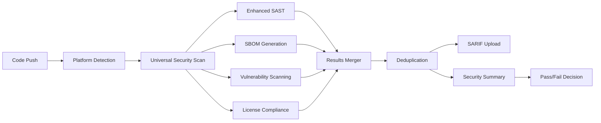

# MedDevice Flutter Application

🏥 A secure, enterprise-grade Flutter application for medical device management with comprehensive multi-platform security scanning and regulatory compliance validation.

## 🚀 Features

- **Cross-Platform Support**: Flutter app with web, mobile (Android/iOS), and desktop support
- **Enterprise Security**: Multi-layered security pipeline with medical-grade vulnerability detection
- **Regulatory Compliance**: FDA, HIPAA, and medical device cybersecurity standards built-in
- **Responsive Design**: Optimized UI for all screen sizes and platforms
- **Real-time Monitoring**: Continuous security monitoring with automated threat detection

## 🏗️ Architecture

### Project Structure
```
meddevice-app-flutter/
├── lib/
│   ├── core/
│   │   ├── constants/   # Application constants
│   │   ├── router/      # Go router configuration
│   │   ├── theme/       # App theme and colors
│   │   └── utils/       # Core utilities (responsive, fonts, icons)
│   ├── features/
│   │   ├── auth/        # Authentication (data/domain/presentation)
│   │   ├── dashboard/   # Dashboard module
│   │   ├── patients/    # Patient management
│   │   ├── profile/     # User profile
│   │   ├── reports/     # Medical reports
│   │   └── settings/    # Application settings
│   ├── shared/
│   │   ├── services/    # Security, network, storage services
│   │   └── widgets/     # Shared UI components and layouts
│   └── main.dart        # Application entry point
├── android/             # Android platform files
├── ios/                 # iOS platform files
├── web/                 # Web platform files
├── windows/             # Windows desktop files
├── macos/               # macOS desktop files
├── linux/               # Linux desktop files
├── .github/
│   ├── scripts/         # Security scanning Python scripts
│   └── workflows/       # Multi-platform security pipeline
└── artifacts/           # Security scan results and reports
```

### Responsive Design System
- **SimpleResponsive** - Handles responsive layout and overflow protection
- **SimpleFontUtils** - Manages typography and text scaling
- Automatic platform detection and optimization

## 🛡️ Enterprise Security Pipeline

### Multi-Platform Security Architecture
- **Universal SBOM Generation**: Syft + Trivy for CycloneDX 1.4 standard SBOM
- **Multi-Tool Vulnerability Detection**: OSV-Scanner + Trivy + Enhanced Flutter audit
- **Package Manager Security**: npm/yarn/pnpm audit with multi-lockfile support
- **Enhanced SAST**: Semgrep with medical-grade security rules
- **Desktop Platform Scanning**: Windows (winget/choco), macOS (brew), Linux (dpkg/rpm)
- **License Compliance**: SPDX-compliant license validation
- **SARIF Integration**: GitHub Security tab with deduplication engine

### Scan Levels & Triggers
| Level | Trigger | Duration | Security Tools | Compliance |
|-------|---------|----------|----------------|-------------|
| **Quick** | Pull Requests | ~5 min | Basic vulnerability + secrets detection | Standard |
| **Standard** | Push to main/develop | ~10 min | Full dependency + SAST + license check | Enterprise |
| **Comprehensive** | Scheduled (Weekly) | ~15 min | Enhanced SAST + desktop scanning | Medical |
| **Medical-Grade** | Manual/Critical | ~20 min | FDA/HIPAA + maximum security rules | Regulatory |

### Platform Coverage Matrix
| Platform | Dependencies | Vulnerabilities | SAST | License | Desktop Scan |
|----------|-------------|----------------|------|---------|-------------|
| **Flutter/Dart** | ✅ pubspec.lock | ✅ OSV + Custom DB | ✅ Semgrep | ✅ SPDX | N/A |
| **Web (npm)** | ✅ package-lock.json | ✅ npm audit | ✅ Semgrep | ✅ SPDX | N/A |
| **Web (yarn)** | ✅ yarn.lock | ✅ yarn audit | ✅ Semgrep | ✅ SPDX | N/A |
| **Web (pnpm)** | ✅ pnpm-lock.yaml | ✅ pnpm audit | ✅ Semgrep | ✅ SPDX | N/A |
| **Android** | ✅ Auto-detect | ✅ Trivy | ✅ Semgrep | ✅ SPDX | N/A |
| **iOS** | ✅ Auto-detect | ✅ Trivy | ✅ Semgrep | ✅ SPDX | N/A |
| **Windows** | ✅ winget/choco | ✅ Trivy | ✅ Semgrep | ✅ SPDX | ✅ Native |
| **macOS** | ✅ brew list | ✅ Trivy | ✅ Semgrep | ✅ SPDX | ✅ Native |
| **Linux** | ✅ dpkg/rpm | ✅ Trivy | ✅ Semgrep | ✅ SPDX | ✅ Native |

## 🚀 Quick Start

### Prerequisites
- Flutter SDK 3.27.1+
- Dart 3.8.0+
- Node.js 18+ (for web dependencies)

### Installation
```bash
# Clone the repository
git clone <repository-url>
cd meddevice-app-flutter

# Install Flutter dependencies
flutter pub get

# Install web dependencies (if applicable)
npm install

# Run the application
flutter run
```

### Development Workflow
```powershell
# 1. Install dependencies
flutter pub get

# 2. Run local security checks
flutter analyze
dart fix --dry-run

# 3. Run unit tests
flutter test

# 4. Run integration tests (optional)
flutter drive --target=test_driver/app.dart

# 5. Local security pre-commit scan
gh workflow run "Multi-Platform Security Pipeline" -f scan_level=quick

# 6. Build for specific platform
flutter build web          # Web deployment
flutter build apk          # Android APK
flutter build ios          # iOS (requires macOS)
flutter build windows      # Windows desktop
flutter build macos        # macOS desktop  
flutter build linux        # Linux desktop
```

### Pre-Commit Security Checklist
- [ ] **Code Analysis**: `flutter analyze` passes without errors
- [ ] **Unit Tests**: `flutter test` achieves >80% coverage
- [ ] **Dependency Audit**: No high/critical vulnerabilities in `pubspec.lock`
- [ ] **License Compliance**: All dependencies use approved licenses
- [ ] **Secrets Detection**: No hardcoded secrets or API keys
- [ ] **SAST Clean**: Semgrep security rules pass

## 🔧 Security Pipeline Usage

### Manual Security Scanning
```powershell
# Trigger security pipeline manually (Windows)
gh workflow run "Multi-Platform Security Pipeline" -f scan_level=standard

# Available scan levels:
# - quick: Fast PR validation (5 min)
# - standard: Full enterprise scan (10 min) 
# - comprehensive: Deep security analysis (15 min)
# - medical-grade: Maximum regulatory compliance (20 min)
```

### Automatic Trigger Conditions
```yaml
# Pipeline triggers automatically on:
Push Events:
  - branches: [main, develop]
  - paths: ['lib/**', 'test/**', 'pubspec.yaml', 'pubspec.lock']
  
Pull Request Events:
  - branches: [main]
  - types: [opened, synchronize, reopened]
  
Scheduled Events:
  - cron: '0 2 * * 1' # Every Monday at 2 AM UTC (comprehensive scan)
```

### Security Reports & Artifacts
- **GitHub Security Tab**: SARIF 2.1.0 compliant vulnerability reports
- **PR Comments**: Automated security summaries with risk assessment
- **Downloadable Artifacts** (30-day retention):
  - `universal-sbom.json` - Complete software bill of materials
  - `universal-security-results.sarif` - Merged vulnerability findings
  - `security-summary.json/md` - Executive security dashboard
  - Individual tool results (Trivy, OSV-Scanner, Semgrep, etc.)

### Security Pipeline Architecture


## 📋 Medical Compliance

### FDA Medical Device Requirements
- Data encryption validation (at rest and in transit)
- Access control mechanism verification
- Audit logging compliance
- Data integrity validation
- Secure communication channel verification

### HIPAA Security Standards
- PHI (Protected Health Information) protection
- User authentication and authorization
- Security incident logging and monitoring
- Data breach prevention measures

### SPDX License Compliance Matrix
| Status | Licenses | Action | Medical Device Impact |
|--------|----------|--------|----------------------|
| **🚫 PROHIBITED** | GPL-2.0/3.0, AGPL-3.0, SSPL-1.0, BUSL-1.1 | FAIL Build | Copyleft incompatible with proprietary medical software |
| **⚠️ REVIEW REQUIRED** | LGPL-2.1/3.0, MPL-2.0, EPL-2.0, CC-BY-SA | Flag for Legal | Weak copyleft requiring legal assessment |
| **✅ APPROVED** | MIT, Apache-2.0, BSD-2/3-Clause, ISC, CC0-1.0 | Auto-approve | Permissive licenses safe for medical use |
| **❓ UNKNOWN** | Custom/Unrecognized | Manual Review | Requires manual license verification |

## 🔍 SBOM (Software Bill of Materials)

### Universal SBOM Generation
The pipeline generates enterprise-grade SBOMs using multiple discovery methods:

**Primary Tool**: Syft (with Trivy fallback)
**Format**: CycloneDX 1.4 JSON standard
**Coverage**: Universal multi-platform dependency mapping

### SBOM Components Discovered
```yaml
Flutter/Dart:
  - pubspec.lock dependencies
  - Transitive dependency resolution
  - Dart SDK components
  
Web Ecosystem:
  - package-lock.json (npm)
  - yarn.lock (Yarn)
  - pnpm-lock.yaml (pnpm)
  - Node.js runtime dependencies
  
Native Platforms:
  - Android: Gradle dependencies, AAR libraries
  - iOS: CocoaPods, Swift Package Manager
  - Windows: System libraries, native DLLs
  - macOS: Homebrew packages, frameworks
  - Linux: dpkg/rpm system packages
```

### SBOM Security Analysis
- **Vulnerability Mapping**: Each component cross-referenced with CVE databases
- **License Compliance**: SPDX license identification and validation
- **Supply Chain Risk**: Dependency depth and maintainer analysis
- **Outdated Components**: Version freshness and update recommendations

## 📊 Security Metrics & Thresholds

### Granular Fail Strategy
| Severity | Standard Max | Medical-Grade Max | Action | Impact |
|----------|-------------|-------------------|--------|--------|
| **Critical** | 0 | 0 | 🚫 FAIL | Build fails immediately |
| **High** | 5 | 0 | 🚫 FAIL | Enterprise security breach |
| **Medium** | 50 | 10 | ⚠️ WARNING | Review recommended |
| **Low** | ∞ | 20 | ℹ️ INFO | Documentation only |
| **License Violations** | 0 | 0 | 🚫 FAIL | Legal compliance failure |

### Security Dashboard Metrics
```json
{
  "analysis": {
    "total_findings": 0,
    "critical": 0,
    "high": 0, 
    "medium": 0,
    "low": 0,
    "license_violations": 0
  },
  "platform_coverage": {
    "flutter": true,
    "web": true,
    "android": true,
    "ios": true,
    "desktop": true
  },
  "compliance_status": "PASS|WARNING|FAIL",
  "risk_score": "0-100",
  "scan_duration": "seconds",
  "tools_executed": ["trivy", "osv-scanner", "semgrep"]
}
```

### Medical Device Compliance Validation
- **FDA Cybersecurity Standards**: Pre-market and post-market requirements
- **HIPAA Security Rule**: Technical, administrative, and physical safeguards
- **ISO 14971**: Medical device risk management
- **IEC 62304**: Medical device software lifecycle processes

## 🛠️ Configuration

### Environment Variables
- `FLUTTER_VERSION`: Flutter SDK version (default: 3.27.1)
- `SCAN_LEVEL`: Security scan depth (quick/standard/comprehensive/medical-grade)

### Advanced Pipeline Configuration
The security pipeline (`.github/workflows/security-pipeline.yml`) features:

**Intelligent Platform Detection**:
```yaml
has-flutter: $(test -f pubspec.yaml)
has-web: $(test -d web -o -f package.json)
has-android: $(test -d android)
has-ios: $(test -d ios) 
has-desktop: $(test -d windows -o -d macos -o -d linux)
```

**Performance Optimizations**:
- Parallel job execution with dependency management
- Comprehensive tool caching (Trivy, Syft, OSV-Scanner)
- Conditional scanning based on file path changes
- Background job execution for long-running scans

**Enterprise Features**:
- Concurrency control to prevent resource conflicts
- Timeout protection (15-20 minutes max)
- Graceful degradation with fallback mechanisms
- Artifact retention policies (30 days)

**Python Security Modules**:
```bash
.github/scripts/
├── desktop_scan.py      # Windows/macOS/Linux native scanning
├── flutter_audit.py     # Enhanced Flutter security audit
├── license_check.py     # SPDX license compliance validation
├── merge_results.py     # SARIF deduplication and merging
└── security_summary.py  # Executive dashboard generation
```

## 📄 License

This project is licensed under the MIT License - see the LICENSE file for details.

## 🤝 Contributing

### Contribution Workflow
1. **Fork & Clone**: Fork the repository and clone locally
2. **Branch**: Create a feature branch from `develop`
   ```bash
   git checkout -b feature/your-feature-name develop
   ```
3. **Develop**: Make your changes following the security checklist
4. **Test**: Run local tests and security checks
   ```powershell
   flutter test
   flutter analyze
   gh workflow run "Multi-Platform Security Pipeline" -f scan_level=quick
   ```
5. **Commit**: Use conventional commit messages
   ```bash
   git commit -m "feat(auth): add biometric authentication support"
   ```
6. **Push & PR**: Push to your fork and create a pull request to `main`

### Pull Request Requirements
- [ ] **Security Scan**: PR automatically triggers quick security scan
- [ ] **Code Review**: At least one maintainer approval required
- [ ] **Tests**: New features must include unit tests
- [ ] **Documentation**: Update README if adding new features
- [ ] **Compliance**: Medical device compliance maintained

### Security Standards for Contributors
- **Zero Tolerance**: Critical/High vulnerabilities block merge
- **License Compliance**: Only approved licenses (MIT, Apache-2.0, BSD)
- **Secrets**: Never commit API keys, passwords, or sensitive data
- **Dependencies**: Justify new dependencies in PR description

## 🔧 Troubleshooting

### Common Security Pipeline Issues

#### SBOM Generation Fails
```bash
# Issue: Empty SBOM or Syft failure
# Solution: Check if pubspec.lock exists and is valid
flutter pub get
syft . -o cyclonedx-json=test-sbom.json

# Fallback: Use Trivy
trivy fs . --format cyclonedx --output fallback-sbom.json
```

#### Security Scan Timeout
```bash
# Issue: Pipeline exceeds timeout limits
# Solution: Run with quick scan level first
gh workflow run "Multi-Platform Security Pipeline" -f scan_level=quick

# For large projects, consider excluding non-critical paths
```

#### License Compliance Failure
```bash
# Issue: Prohibited license detected
# Solution: Check package licenses manually
flutter pub deps --json | jq '.packages[] | {name, version}'

# Replace problematic dependencies with approved alternatives
```

#### High/Critical Vulnerabilities
```bash
# Issue: Build fails due to security vulnerabilities
# Solution: Update vulnerable dependencies
flutter pub upgrade
flutter pub outdated

# Check for security advisories
dart pub audit
```

### Getting Help
- **Security Issues**: Create issue with `security` label
- **Pipeline Problems**: Check [workflow runs](https://github.com/your-repo/actions)
- **Medical Compliance**: Contact compliance team for regulatory questions
- **Documentation**: See [Security Pipeline Enhancements](SECURITY_PIPELINE_ENHANCEMENTS.md)

## 📚 Additional Resources
- [Flutter Security Best Practices](https://flutter.dev/docs/deployment/security)
- [OWASP Mobile Top 10](https://owasp.org/www-project-mobile-top-10/)
- [FDA Medical Device Cybersecurity](https://www.fda.gov/medical-devices/digital-health-center-excellence/cybersecurity)
- [NIST Cybersecurity Framework](https://www.nist.gov/cyberframework)
- [SARIF Standard Documentation](https://sarifweb.azurewebsites.net/)

---

**MedDevice Flutter Application** - Enterprise-grade security for medical device software development.